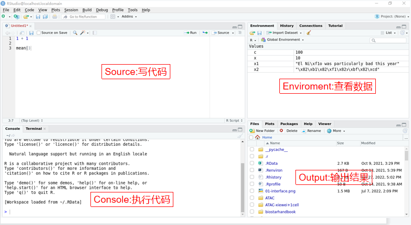
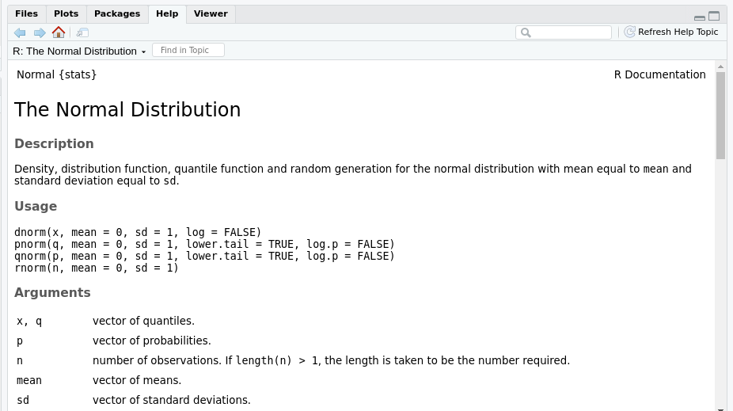

```{r setup, include=FALSE}
library(learnr)
library(tibble)
library(gradethis)
knitr::opts_chunk$set(echo = TRUE)
learnr::tutorial_options(
  exercise.timelimit = 60, 
  exercise.checker = gradethis::grade_learnr)
```


## 介绍

R语言是为科研研究工作者设计的一套数学编程语言，主要用于统计分析、绘图、数据挖掘。

如果你想要学习R语言，你需要安装以下：

* 在你的电脑上安装R
* 安装 RStudio

### 安装 R

要下载 R，请转到综合性 R 存档网络 CRAN。
CRAN 由一组分布在世界各地的镜像服务器组成，用于分发 R 和 R 包。
不要尝试选择离您最近的镜像：而是使用云镜像, <https://cloud.r-project.org>, 来下载 R。

### 安装 RStudio

RStudio 是用于 R 编程的集成开发环境或 IDE。
从<http://www.rstudio.com/download>下载并安装它。

启动 RStudio 时，您会在界面中看到下面的界面：

```{r fig1, echo = FALSE, out.width = "80%", dpi=270}

```

1.左上角：Source(源)

Source是写代码的地方，同时也是用来查看文件和数据的地方。
Console也能够写代码，但是代码得不到保存。代码需要保存在R脚本文件(后缀为 `.R`)里。

2.左下角：Console(控制台)

Console是执行代码的地方。可以在Console中写入代码。

3.右上角：Enviroment(环境)

Enviroment是一个展示当前工作环境中所有自己定义的对象，包括数据(data)、值(value)和函数(function)，并展示了一些简要信息。
History主要包含所有运行过的代码。
Connection和Tutorial不常使用。

4.右下角：Output(输出)

* Files是查看文件的区域。
* Plots是查看图像的区域，主要是通过R代码运行生成的图像。
* Packages是查看所有安装的R包的区域，可以行使安装更新卸载R包的功能。
* Helps是查看帮助文档的区域。

## 执行代码

### 赋值和计算

R代码主要分为两种：赋值和计算。
其中含有`<-`的是赋值，不含有`<-`的是计算。

* 赋值主要用来新建一个对象或者改变已有对象的值。
`<-`符号首先得出右边的值，然后将值拷贝到左边的名字，构成一个对象。

```{r exercise1, exercise=TRUE}
a <- 1
a
b <- "x"
b
c <- "1"
c
d <- NA
d
e <- TRUE
e
```

提示：代码框中用户可以自由输入，为对象赋予你想要的值。

计算可以分为直接输入数值计算和赋予对象数值再通过对象进行计算。

* 直接输入数值计算：

```{r exercise2, exercise=TRUE}
1 + 1
2 - 2
3 * 3
4 / 4
```

* 首先赋予对象数值，然后通过对象进行计算：

```{r exercise3, exercise=TRUE}
x <- 2
y <- 3
x + y
x * y
x ^ y
```

### Value类型

从上面的赋值部分可以看出，R语言中的值的类型主要包括下面几种：

* 数字型: 指表示具体数值的Value。例如，`5`、`0.5`、`NaN`、`Inf`等。
* 字符型：指需要被引号包围的Value，里面可以是数字也可以是字符。例如，`"1"`、`"a"`、`"$"`等。
* 逻辑型：指用来判断正确与否的Value，其常量主要有两种，`TRUE`和`FALSE`。

### 逻辑运算

前面内容提到逻辑值，R 语言中不仅包括简单的数学计算，还有简单的逻辑运算。

* 关系运算符

```{r, eval=FALSE}
`==` 等于
`!=` 不等于
`<`  小于
`>`  大于
`<=` 小于等于
`>=` 大于等于
```

使用关系运算符来计算，结果为逻辑值：

```{r login, exercise=TRUE}
x = 5
x > 3

y <- NA
is.na(y)
```

* 逻辑运算符

```{r, eval=FALSE}
`&` 且
`|` 或
`!` 反义符号，可理解为不 
```

注意下面几个逻辑运算符的结果：

```{r login1, exercise=TRUE}
2 == 2 & 2 == 3 & 5 == 5
TRUE | FALSE | FALSE
!(TRUE | FALSE) & TRUE
```

## 向量

R使用各种类型的的向量来储存单一类型的数据，上面交互代码框中赋值的`a`、`b`、`x`等都是向量。

向量不仅可以是单元素的向量，也可以创建多元素的向量，这里需要用到`c()`函数：

```{r exercise4, exercise=TRUE}
x <- c(1, 2, 3)
y <- c("a", "b", "c")
z <- c(TRUE, FALSE, FALSE)
```

注意：向量中可以包含`NA`，以及不同类型的值也可以组成一个多元素向量。
在一个赋值代码外面加上`()`可以同时显示出变量的内容。

```{r exercise5, exercise=TRUE}
(m <- c(1, 2, 3, 4, NA))
(n <- m[!is.na(m)])
(com <- c(1, "2", "a", TRUE))
```

通过`length()`函数可以查看向量的长度。

```{r exercise6, exercise=TRUE, exercise.setup="exercise5"}
length(com)
```

注：这里判断的就是上一个代码框中所赋值的向量的长度。

向量具有索引(index)，可以根据索引确定每一个元素的位置，根据索引提取向量中的元素，这里需要使用方括号`[]`：

```{r exercise7, exercise=TRUE}
num <- c("one", "two", "three", "four", "five", "six", "seven")
num[1]
num[5]
num[-1]
```

其中`[-1]`是用来删除这个索引位置下向量的元素。

可以在方括号中使用另一个向量提取多个元素：

```{r exercise8, exercise=TRUE, exercise.setup="exercise7"}
num[c(1,4,7)]
```

当然也可以使用`:`来从向量提取连续的元素：

```{r exercise9, exercise=TRUE, exercise.setup="exercise7"}
num[1:3]
num[-(1:3)]
```

此外，还可以使用`name()`函数给向量中的每个元素命名，然后根据名称提取元素：

```{r exercise10, exercise=TRUE, exercise.setup="exercise7"}
names(num) <- c("a", "b", "c", "d", "e", "f", "g")
num["b"]
num["f"]
```

如果你想要对两个向量取交集或者并集，可以使用`intersect()`和`union()`：

```{r exercise-in, exercise=TRUE}
x <- c(1:10)
y <- c(5:13)
## 交集
intersect(x, y)
## 并集
union(x, y)
## 只存在于其中一个向量中的元素，注意下面的区别
setdiff(y, x)
setdiff(x, y)
```

## 函数

函数是一个执行一个任务的语句，R语言里面包含了很多内置函数，这些需要安装相关的R包。
R语言中最常用的R包是tidyverse，使用`install.packages()`函数安装，并使用`library()`加载：

```{r, eval=FALSE}
install.packages("tidyverse")
library(tidyverse)
```

### 调用函数

R 里面有大量的内置函数，它们的调用方式如下：

```{r, eval=FALSE}
function_name(arg1 = val1, arg2 = val2, ...)
```

下面会几个示例说明函数的使用。

* 计算函数

```{r exercise11, exercise=TRUE}
a <- c(1, 2, 3, 4, 5)
#平均数
mean(a)
#方差
sd(a)
#求和
sum(a)
```

* 序列函数

```{r exercise12, exercise=TRUE}
#等差数列
seq(0, 10, 2.5)
seq(from = 0, to = 10, by = 2.5)

#序列重复
rep(3, 2)
rep(1:4, 3) 
rep(1:4, each = 3)
```

注意：加入参数`each`和未加入参数`each`的区别。

* 排序函数

```{r exercise13, exercise=TRUE}
b <- c(4, 7, 1, 5, 9, 6, 2, 8, 3)
# 从小到大
sort(b)
# 从大到小
sort(b, decreasing = TRUE)
```

* 随机函数

```{r exercise14, exercise=TRUE}
# 生成100个20到80之间的均匀分布的随机数
num_unif <- runif(100, 20, 80)
hist(num_unif)

# 平均值为80，方差为20的正态分布的100个随机数
num_norm <- rnorm(100, 80, 20)
hist(num_norm)
```

如果用户对所使用的函数的了解不够透彻，或者不知道如何使用该函数，可以通过`help()`函数或者`?`来查看帮助。

```{r, eval=FALSE}
help(rnorm)
?rnorm
```

运行上述代码后会在RStudio的Help部分查看帮助。

```{r fig2, echo = FALSE, out.width = "80%", dpi=270}

```

## 常见数据类型

### 列表(List)

列表是 R 语言的对象集合，可以保存不同类型的数据，可以是数字、字符串、向量、矩阵，甚至可以是另一个列表。
使用`list()`函数创建列表。


```{r exercise15, exercise=TRUE}
lst1 <- list(c(1:10), c(1:9), c(1:20))
print(lst1)
lst2 <- list("rstudio", c(1:5), lst1)
print(lst2)
```

同样的，可以通过`[]`提取列表中元素，以及为列表元素命名来提取：

```{r exercise16, exercise=TRUE, exercise.setup="exercise15"}
lst1[1]
names(lst1) <- c("a", "b", "c")
lst1["b"]
```

此外，要注意`[]`和`[[]]`的区别：`[]`是提取list的元素，`[[]]`是提取list中每个元素中具体的变量。

```{r exercise17, exercise=TRUE, exercise.setup="exercise15"}
lst1[2]

lst1[[2]]
```

对列表进行操作：

* 添加元素

```{r exercise18, exercise=TRUE}
lst3 <- list(c(1:5), c("R", "Python", "Java"), c(TRUE, TRUE, FALSE))
lst3
lst3[4] <- c("1", "2", "4")
lst3
```

* 删除元素

```{r exercise19, exercise=TRUE,exercise.setup="exercise18"}
lst3[4] <- NULL
lst3
```

* 更新元素 

```{r exercise20, exercise=TRUE, exercise.setup="exercise19"}
lst3[[3]] <- c("RNA", "ATAC", "CHIP")
lst3
```

### 矩阵(matrix)

前面提到的向量是一维数据，下面我们介绍的矩阵是二维数据，由行和列组成，矩阵只包含一种数据类型，如数字、字符等。
矩阵由`matrix()`函数创建。其函数格式如下：

```{r, eval=FALSE}
matrix(data = NA, nrow = 1, ncol = 1, byrow = FALSE, dimnames = NULL)
```

* 创建矩阵

```{r exercise21, exercise=TRUE}
M <- matrix(c(1:10), nrow = 2, byrow = FALSE)
M
N <- matrix(c(1:10), nrow = 2, byrow = TRUE)
N
```

* 查询矩阵元素

```{r exercise22, exercise=TRUE, exercise.setup="exercise21"}
M[2,1]
M[1,4]
M[,2]
M[2,]
## 定义行名和列名
rownames(M) <- c("row1", "row2")
colnames(M) <- c("col1", "col2", "col3", "col4", "col5")
```

* 矩阵计算

```{r exercise23, exercise=TRUE}
M1 <- matrix(c(1, 2, 3, 4, 5, 6), nrow = 2)
M2 <- matrix(c(6, 5, 4, 3, 2, 1), nrow = 2)

#加
M1 + M2
#减
M1 - M2
#乘
M1 * M2
#除
M1 / M2
```

* 转置矩阵

```{r exercise24, exercise=TRUE, exercise.setup="exercise23"}
M1
M3 <- t(M1)
M3
```

### 数据框(dataframe)

数据框和矩阵一样都是二维数据，但不同的是矩阵只能一种类型的变量，而数据框中可以是多种类型的变量。
同一列的变量类型要相同，不同列的变量类型可以不同。
数据框也就是我们经常挂在嘴边的“表格”。
R语言中数据框由`data.frame()`函数来创建：

```{r, eval=FALSE}
data.frame(..., row.names = NULL, check.rows = FALSE,
           check.names = TRUE, fix.empty.names = TRUE,
           stringsAsFactors = FALSE)
```


* 创建数据框

```{r exercise25, exercise=TRUE}
df <- data.frame(name = c("rooney", "rashford", "degea"),
                 number = c("10", "19", "1"),
                 salary = c(30, 25, 38))
df
```

可以通过`summary()`函数来得到数据框的基本信息：

```{r exercise26, exercise=TRUE, exercise.setup="exercise25"}
summary(df)
```

* 指定某行某列

可以根据`[]`，此外，指定列还可以根据`$`：

```{r exercise27, exercise=TRUE, exercise.setup="exercise25"}
#显示前面两行
df[1:2, ]
#显示前面两列
df[, 1:2]
#显示第二行第三列
df[2, 3]
#通过$指定具体列
df$name
```

* 扩充数据框

这里介绍直接从数据框上添加，以及合并形成新的数据框：

```{r exercise28, exercise=TRUE}
df1 <- data.frame(cell = c("astro", "micro", "oligo"),
                 number = c(1000, 500, 300),
                 species = c("human", "mouse", "rat")
                 )
df1$methods <- c("RNA", "ATAC", "Single")
##删除method列
df1$methods <- NULL
##两个数据框合并
df2 <- data.frame(cell = c("T", "B"),
                  number = c(200, 100),
                  species = c("fish", "rabbit")
                  )
df3 <- rbind(df1, df2)
df3
```

### tibble

前面一节介绍了数据框(dataframe)，因为本教程主要使用的R包是 `tidyverse`。
tibble是tidyverse的一部分，可以说是dataframe的进阶版，更加直观易操作。
使用 `tibble()`函数来创建tibble：

```{r exercise29, exercise=TRUE}
tib <- tibble(school = c("njmu", "njau", "nju"),
              means = c("11", "211", "985"),
              number = c(4000, 3000, 5000)
              )
tib
```


另一种创建tibble的函数是`tribble()`。`tribble()`是为代码中的数据输入定制的：列标题以`~`开头，条目用逗号分隔。

```{r exercise30, exercise=TRUE}
trib <-tribble(
  ~x, ~y, ~z,
  "a", 2, 3.6,
  "b", 1, 8.5
)
trib
```

dataframe可以跟tibble进行互换，使用`as.data.frame()`和`as_tibble()`函数。
同时可以根据`class()`函数来查看数据类型。

```{r exercise31, exercise=TRUE, exercise.setup="exercise29"}
df <- as.data.frame(tib)
class(df)
tib1 <- as_tibble(df)
class(tib1)
```

注意：这里使用的初始tibble是前面创建的`tib`。

tibble和dataframe相比，在数据分析中主要有亮点优势。
首先是打印方面，它只显示前10行，以及适应屏幕的所有列，这使得处理大数据变得更加容易。
再者是子集方面，dataframe的取子集方法tibble都能使用。
与dataframe相比，tibble更严格：它们从不进行部分匹配，并且如果您尝试访问的列不存在，它们将生成警告。

## 练习

1.从下面向量中得到所有小于10且不包含`NA`的值的向量。

```{r exercise32, exercise=TRUE}
x <- c(10, 33, 41, 8, 3, NA, 9, 29, NA)

```

```{r exercise32-solution}
x <- c(10, 33, 41, 8, 3, NA, 9, 29, NA)
y <- x[!is.na(x) & x > 10]
y
```

2.创建一个dataframe，其第一列`x`是100个1，第二列`y`是a和b交叉，第三列`z`是先50个a再50个b。

```{r exercise33, exercise=TRUE}

```

```{r exercise33-solution}
df <- data.frame(x = 1,
                 y = rep(c("a", "b"), 50),
                 z = rep(c("a", "b"), each = 50)
                 )
df
```

3.下面给出一个tibble，根据下面要求完成操作：
* 提取tibble的第2列和第2行
* 修改tibble中第1列第3行的内容为220

```{r exercise34, exercise=TRUE}
ex <- tibble(number = c(50, 100, 200),
             English = c("Mon", "Wed", "Sun"),
             day = c("1", "3", "7")
              )

```

```{r exercise34-solution}
ex[,2]
ex[2,]
ex[3,1] <- 220
```

## 课后问题

### 单选题

```{r quiz1, echo=FALSE}
question("1.下列用来转换数据框的函数是：",
  answer("A: as.list"),
  answer("B: as.matrix"),
  answer("C: as.data.frame", correct = TRUE),
  answer("D: as.vector"))
```

```{r quiz2, echo=FALSE}
question("2.下列函数不能直接查看mean函数的帮助文档的是：",
  answer("A: ?mean"),
  answer("B: ??mean", correct = TRUE),
  answer("C: help(mean)"),
  answer("D: help('mean')"))
```

```{r quiz3, echo=FALSE}
question("3.下列选项不是逻辑型数据的是：",
  answer("A: T"),
  answer("B. F"),
  answer("C: NA"),
  answer("D: NO", correct = TRUE))
```

```{r quiz4, echo=FALSE}
question("4.下列用于修改矩阵变量名的函数是：",
  answer("A: rename函数"),
  answer("B: colnames函数", correct = TRUE),
  answer("C: names函数"),
  answer("D: name函数"))
```

```{r quiz5, echo=FALSE}
question("5.一个数据对象若包含不同的数据类型，则其可以采用以下哪种数据结构：",
  answer("A: 向量"),
  answer("B: 矩阵"),
  answer("C: 列表"),
  answer("D: 数据框", correct = TRUE))
```

```{r quiz6, echo=FALSE}
question("6.以下R包的加载方式正确的是：",
  answer("A: install.package函数"),
  answer("B: library函数", correct = TRUE),
  answer("C: libPaths函数"),
  answer("D: install函数"))
```

```{r quiz7, echo=FALSE}
question("7.可将对象转换为逻辑型数据的函数是：",
  answer("A: as.character"),
  answer("B: is.numeric"),
  answer("C: as.logical", correct = TRUE),
  answer("D: is.logical"))
```

```{r quiz8, echo=FALSE}
question("8.纵向合并两个数据框，使用的函数是：",
  answer("A: rbind", correct = TRUE),
  answer("B: bind"),
  answer("C: cbind"),
  answer("D: 其余都不对"))
```

```{r quiz9, echo=FALSE}
question("9.现在有一个向量x = c(1,2,3,4,NA)，能够去掉NA的代码是：",
  answer("A: is.na(x)"), 
  answer("B: na(x)"),
  answer("C: !is.na(x)", correct = TRUE),
  answer("D: !na(x)"))
```

```{r quiz10, echo=FALSE}
question("10.有一个五行五列的数据框df，如果要提取第4行第3列的值，下面正确的是：",
  answer("A: df(4,3)"),
  answer("B: df[4,3]"),
  answer("C: df[3,4]"),
  answer("D: df[[4,3]]", correct = TRUE))
```

```{r quiz11, echo=FALSE}
question("11.按照性别、年龄升序，可以表达为：",
  answer("A: order(gender), order(age)"),
  answer("B: order(gender, age)", correct = TRUE),
  answer("C: order(gender asc)(age asc)"),
  answer("D: 其余都正确"))
```

```{r quiz12, echo=FALSE}
question("12.在R语言中，以下变量定义正确的是：",
  answer("A: _a", message = "变量名不能以下划线为开头"),
  answer("B: 3a", message = "变量名不能以数字为开头"),
  answer("C: a_2", correct = TRUE),
  answer("D: if", message = "变量名最好不用已有的函数"))
```

```{r quiz13, echo=FALSE}
question("13.有一个名为df的数据框，其中有变量x1和x2，如何创建一个sumx，储存x1和x2的和？",
  answer("A: sumx <- x1 + x2"),
  answer("B: sumx <- df$x1 + df$x2"),
  answer("C: df$sumx <- df$x1 + df$x2", correct = TRUE),
  answer("D: 以上都不对"))
```

### 多选题

```{r quiz14, echo=FALSE}
question("14.创建一个从12到20，间隔为3的向量，下面代码正确的是：",
  answer("A: seq(from = 12, to = 30, by = 3)", correct = TRUE),
  answer("B: rep(from = 12, to = 30, by = 3)"),
  answer("C: seq(12, 20, 3)", correct = TRUE),
  answer("D: seq(30, 12, 3)"))
```

```{r quiz15, echo=FALSE}
question("15.下列函数中，整除中得到商数以及余数的两个函数是：",
  answer("A: /"), 
  answer("B: %/%", correct = TRUE),
  answer("C: %%", correct = TRUE),
  answer("D: //"))
```

### 操作题

```{r quiz16, echo=FALSE}
question_text("16.创建一个从1.1到2，长度为10的向量",
              answer("seq(from = 1.1, to = 2, length = 10)", correct = TRUE),
              allow_retry = TRUE)
```

```{r quiz17, echo=FALSE}
question_text("17.创建一个重复因子序列species: 水平数为3，各水平重复两次，3个水平为human、mouse、rat",
  answer("species <- rep(c('human', 'mouse', 'rat'), each = 2)", correct = TRUE), 
  answer('species <- rep(c("human", "mouse", "rat"), each = 2)', correct = TRUE),
  allow_retry = TRUE)
```

```{r quiz18, echo=FALSE}
question_text("18.由1,2,...,16构成4x4的矩阵A，按行输入：",
  answer("A <- matrix(c(1:16), nc = 4, nr = 4, byrow = T)", correct = TRUE),
  allow_retry = TRUE)
```

